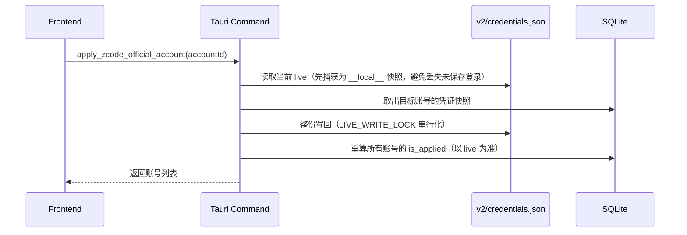
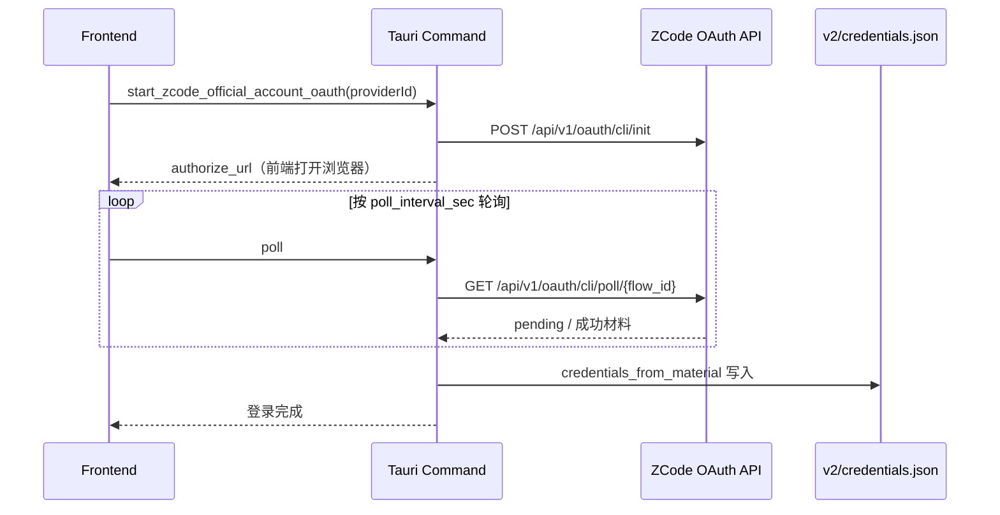

# ZCode 后端模块说明

## 一句话职责

- `zcode/` 负责 ZCode 的 provider 注册表（`v2/provider_config.json`）、官方账号快照切换（`v2/credentials.json`）、OAuth 浏览器登录、全局提示词与托盘/会话接入；ZCode 自己的运行时状态一律不接管。

## Source of Truth

- **新世代 provider 注册表 = `v2/provider_config.json`**。这是本模块唯一写入 provider 的文件。
- **`v2/config.json` 是旧世代**，只在 `provider_config.json` 不存在时被 ZCode 运行时读取。`provider_config.json` 一旦存在，`config.json` 的 `provider` map 就**完全被忽略**（见 `constants.rs` 的世代说明）。本模块只管理新世代，旧世代文件不动。
- **`v2/credentials.json` 是扁平 `string -> string` map**，值是 `enc:v1:` 密文。官方账号切换 = 整份快照/还原这个文件，不解析内部结构（除身份展示外）。
- `v2/setting.json` 只读，用于取 `dataBaseDir` 等桌面设置；本模块不改写它。
- 运行时根目录：默认 `~/.zcode`，可用 `ZCODE_DATA_BASE_DIR` 环境变量覆盖（桌面端与 CLI 都认）。自定义根目录存 DB 的 `zcode_settings_config` `common` 记录。
- provider 条目按 `providerId` 归属本模块，**不是整份文档**：`provider_config.json` 里其他 provider、其他键必须原样保留。

## 核心设计决策（Why）

- **providerId 命名空间**：`account:` 是 ZCode 保留的内置账号前缀（带该前缀的规则拒绝 `config.access` 覆盖、且不可禁用）；`builtin:` 是内置目录；`custom:` 是用户自定义。本模块新建的 provider 一律用 `custom:`，**不发明自己的命名空间**——ZCode 自己就用这个前缀区分自定义与目录 provider。
- **官方账号是「快照 + 还原」，不是「解析后重建」**：`credentials.json` 的值是密文，且键集合会随上游版本变化。切换账号的做法是整份捕获再整份写回，因此**新增未知键天然被保留**。任何「只挑几个已知键重建文件」的改写都会静默丢掉新键。
- **`enc:v1:` 只解密用于展示身份**（email / username）。密钥优先级：环境变量 `ZCODE_CREDENTIAL_SECRET` → 回退 `zcode-credential-fallback:<nodePlatform>:<homedir>:<username>`（与 ZCode 的 Node 实现逐字对齐，见 `credential_cipher.rs` 里的 Node 测试向量）。**密钥推导规则不能改**：改了就连自己的旧数据都读不出来。
- **`is_applied` 以 live 文件为准，不以存储标记为准**。真实运行中的登录由 `credentials.json` 决定；存储的 `is_applied` 只是缓存。因此每次列出账号都要拿 live 身份回推，否则会出现两个「默认」标签。
- **OAuth 无 PKCE、无客户端 state、无深链接**：`POST /api/v1/oauth/cli/init` → 打开 `authorize_url` → 轮询 `GET /api/v1/oauth/cli/poll/{flow_id}`。`zcode://` 协议属于 ZCode 桌面应用，不是本应用的登录回调。`CLIENT_APP_VERSION` 仅用于归因，可用 `ZCODE_APP_VERSION` 覆盖。

## 关键流程

官方账号切换：

OAuth 登录：

## 易错点与历史坑（Gotchas）

- **改 provider 必须读-改-写**。`save_zcode_common_config` 先读现有记录再写，是为了保住 `official_account_index`；同理写 `provider_config.json` 必须只替换自己那一项。
- **`custom:` 前缀不是可选项**。写成别的命名空间，ZCode 会当成目录 provider 或直接忽略，且**不报错**。
- **`LIVE_WRITE_LOCK` 不可绕过**。并发写 `credentials.json` 会互相截断，表现为登录随机失效。
- **登录取消**用 `LOGIN_CANCELLED` 常量而非错误字符串字面量判断；前端靠它区分「用户取消」与「真失败」。
- **`same_login` / `identity_matches` 按字段级比对**（provider_id、account_id、email），不要退化成整份 JSON 比较——live 文件里还有 token 等易变字段，整份比较会导致永远判不相等。
- **`v2/provider_config.json` 的存在与否是世代开关**。若为兼容旧安装而回写 `v2/config.json`，新世代用户看到的仍是 `provider_config.json`，改动**静默无效**。
- **ZCode 的 `providerConfigRules` / `modelConfigRules` 是 `.strict()` 校验的**（上游 schema），未知键会被拒绝。写规则时不要塞自定义字段。
- 全局提示词文件是 `AGENTS.md`，**没有** `AGENTS.override.md` 兄弟文件（与 Codex 不同，见 `constants.rs`）。

## 跨模块依赖

- `session_manager/`：`resolve_zcode_cli_db_path(location)` 解析 `cli/db/db.sqlite`；会话列表读 `v2/sessions/<workspaceId>/<taskId>.json`。
- `proxy_gateway/session_import/zcode.rs`：从同一个 `db.sqlite` 的 `model_usage` 表导入用量（`attempt_index = 0 AND status = 'completed'`）。**两边共用同一个文件路径常量**，改路径要同时改。
- `coding/tools`：MCP / Skills 注册表通过 `zcode` 工具名发现本模块。
- 托盘：`tray_support.rs` 提供 ZCode 的托盘项；新增需要主窗口的入口必须先判断 `lightweight::is_lightweight_mode()`。
- WSL/SSH：默认映射覆盖 `v2/provider_config.json`、`v2/credentials.json`、`cli/config.json`、`AGENTS.md`、`skills/`。**注意 `credentials.json` 含密文，跨机同步后能否解密取决于两端密钥推导输入（用户名/家目录）是否一致**。

## 最小验证

- 新建/修改/删除一个 provider 后，`v2/provider_config.json` 里其他 provider 与未知键逐字未变。
- 切换官方账号后，`credentials.json` 整份变成目标快照；账号列表里恰好一个 `is_applied`。
- 未保存的 live 登录会以 `__local__` 虚拟条目出现，保存后该条目消失、按钮不再出现。
- 取消 OAuth 登录：前端收到取消而非错误，且不产生半写入的 `credentials.json`。
- 真实文件解密：用 `credential_cipher` 的单元测试向量，且对真实 `~/.zcode/v2/credentials.json` 能解出 email/username。
- 网关「导入本地用量」对同一份 `db.sqlite` 跑两次：第二次 `inserted=0 updated=0 skipped=全部`（幂等）。

## 何时更新本文件

- 改动 providerId 命名空间、凭证密钥推导、OAuth 端点契约、或 `credentials.json` 的读写方式时，同一任务内更新本文件。
- 若某条经验上升为跨 CLI 通用规则（如「新增 CLI 的接入点清单」），同步补到根 `AGENTS.md` 与 `docs/new-cli-onboarding-sop.md`。
