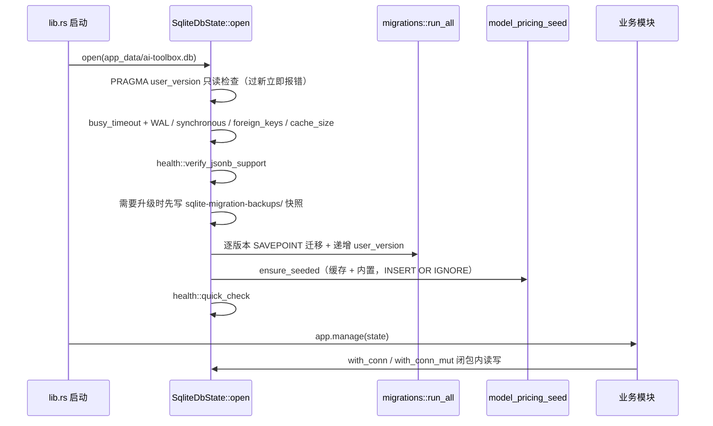

# DB 后端模块说明

> 本文件只写 `db/` 模块**特有**的语义与坑。数据库的全局铁律（JSONB 主库、表形状、启动兼容检查、迁移前快照、applied 事务、seed 只增不改、已发布迁移不可追加等）在根 `AGENTS.md` 的「SQLite JSONB Database Notes」，不在此重复。

## 一句话职责

- `db/` 是应用唯一的持久化底座：管理 SQLite JSONB 主库的连接/PRAGMA/迁移/健康检查，提供通用 JSONB 读写 helper，并托管模型定价的 seed 与远端同步。

## Source of Truth

- 主库是 `{app_data}/ai-toolbox.db`（`db::SQLITE_DATABASE_FILE`），全局只有一个 `SqliteDbState`，在 `lib.rs` 启动时 `open` 后 `app.manage`。
- **schema 版本的事实源是 SQLite 自己的 `PRAGMA user_version`，没有 `_migrations` 台账表**（`_migrations` 是 OMO 配置文件里的概念，别找错地方）。当前目标版本是常量 `migrations::TARGET_SCHEMA_VERSION`，历史版本号是冻结契约。
- `DbTable::AppMigration` 虽然占了一个表名，但全仓没有任何读写点，是历史遗留；不要以为迁移台账存在那里。
- 表名的唯一来源是 `schema::DbTable`（`ALL_TABLES` 是建表全集）；表名与 JSON 字段路径都要经过 identifier 校验（字母/数字/下划线，首字符必须是字母或下划线），外部输入不得直接 `format!` 进 SQL。
- 少数**非 JSONB 的独立物理表**不在 `DbTable` 里：`proxy_request_logs`、`usage_daily_rollups`（网关用量，归 `proxy_gateway/`）与 `model_pricing`（模型定价，归 `proxy_gateway/pricing.rs` 与本文的 seed）。它们用列式 schema，读写走原生 SQL，不套 `db_get`/`db_put`。
- 模型定价的默认数据按「app data 缓存文件 `model_pricing.json` → 内置 `resources/model_pricing.json`」逐条补齐，远端 URL 列表由后端独占维护（主源 + jsDelivr 镜像，顺序回退，前端不传 URL）。缓存文件只是远端数据的缓存；`model_pricing` 表里已有的行（用户可改）才是事实源，seed 只补不覆盖。

## 核心设计决策（Why）

- 单连接 + 单 `Mutex`（`SqliteDbState { conn: Arc<Mutex<Connection>> }`）而不是连接池：本地单机、并发低，串行化换来「不用考虑多连接写锁争用」的简单性；代价是所有 DB 操作全局串行，长闭包会阻塞其它读写。
- 用 JSONB 单表承载业务实体，而不是每个实体一张宽表：字段演进不需要迁移，默认值由各模块 adapter 兜底；代价是查询只能走 `json_extract`，需要过滤/排序的字段必须显式建 JSON 索引。
- 迁移是「每步一个 SAVEPOINT + 单调整数版本号」，没有 down migration；失败即该步回滚并把错误抛给启动流程。
- 升级真实文件库前先落一份迁移前快照，快照失败直接阻断升级——宁可打不开，也不能在没有回退点的情况下改用户库。

## 关键流程

## 易错点与历史坑（Gotchas）

- **嵌套 `with_conn` 会死锁**：`Mutex` 不可重入，在 `with_conn`/`with_conn_mut` 闭包内再次对同一个 `SqliteDbState` 调 `with_conn` 会永久阻塞（不报错）。「先读后写」要么放进同一个闭包，要么用 `db_transaction`（需要 `&mut Connection`，即 `with_conn_mut`）。跨模块的 best-effort 记录（如 `record_provider_last_used_best_effort`）必须在闭包外调用。
- **`db_put` 是整记录覆盖，而且会冻结时间戳**：`db_get`/`db_list` 返回的 Value 被注入了 `id`/`created_at`/`updated_at`；把这条记录直接 `db_put` 回去时 JSON 已带 `updated_at`，写入的就是旧值，**不会刷新**。局部更新一律用 `db_patch_fields`（除非 patch 显式包含 `updated_at`，它会自动写成当前时间）。用陈旧快照整份 `db_put` 还会丢掉并发写入的相邻字段。
- **`db_patch_fields` 是「读-改-写整条记录」**：它保留未知字段与嵌套路径的兄弟键（`settings_config.env.OLD` 不会被覆盖），但内部先 `db_get` 再 `db_put`，并发写同一记录仍可能互相覆盖；共享记录要按「谁拥有哪些字段」分工，不要靠它兜底并发。
- **`db_patch_where_bool` + 单条 patch 表达不了互斥状态**：`is_applied` 这类「同表至多一条为真」的切换必须用 `db_update_applied_status`（单事务内先全清再置位，目标不存在则整体回滚），不能在业务层先 `db_patch_where_bool` 再单独 patch 目标记录。
- **`db_query_by_field` 的类型语义是手写的**：bool 走 `CAST(... AS INTEGER) = 1/0`；整数/浮点分别 CAST；字符串按文本等值（JSON number 不会等于同值字符串）；数组/对象用 `json(a) = json(b)` 做结构比较；`Value::Null` 是 `IS NULL`。过滤/排序字段要有对应 JSON 索引（`is_applied`/`sort_index` 等由 `migrations` 建）。
- **`data` 里是否带 `id` 不可依赖**：写入不会自动剔除，读取时 `db_get` 用列值覆盖 `id`，所以读回再写不会污染读取结果；`db_patch_fields` 在写回前显式移除 `id`。新代码不要假设 `data` 里有或没有 `id`。
- **版本过新必须硬失败**：`ensure_supported_user_version` 在设置任何 PRAGMA 之前跑；`user_version > TARGET_SCHEMA_VERSION` 时返回带 `AI_TOOLBOX_SQLITE_SCHEMA_TOO_NEW` 前缀的错误，`lib.rs` 据此进入无数据库的恢复界面（`startup_recovery` + 前端 `get_startup_recovery`），既不降级 schema 也不 `panic!`。回归见 `tauri/tests/sqlite_jsonb.rs` 的「过新版本时文件不被改动」用例。
- **迁移前快照只对真实文件库做**：`in_memory_for_test` / `initialize_connection` 不产生快照；文件库在 `0 < user_version < TARGET` 时写到 `<db 目录>/sqlite-migration-backups/`，写不出来就阻断升级（错误信息里带 from/to 版本）。
- **`change_hook` 目前只在测试里用**：`install_change_recorder` 记录 `(action, database, table, row_id)`，但生产启动路径没有安装它——**DB 层不发任何 Tauri 事件**。需要「改完通知前端」的模块必须自己 `emit`（如 `config-changed`），不要假设写库会触发同步或缓存失效。
- **`backup::backup_to_path` 是唯一的安全拷贝入口**（先 `wal_checkpoint(TRUNCATE)` 再 `conn.backup`）：迁移前快照、备份 zip、恢复前回滚点都用它，不要另写 `conn.backup` 直调。`vacuum` 目前没有生产调用点。
- **模型定价 seed 只增不改**：缓存文件、内置资源、远端同步一律 `INSERT OR IGNORE`，绝不覆盖用户改过的行；缓存文件解析失败只 `warn` 并跳过（不阻断启动）；远端同步成功后用 tmp + rename 写缓存。`set_cache_dir` 是 `OnceLock`，只能在启动时设置一次。
- **同步 DB 调用不能进 async 热路径**：`with_conn` 闭包持有全局锁，长闭包会卡住整个运行时；async 上下文读设置用 `settings::store::load_settings_from_sqlite_state_async`（内部 `spawn_blocking`），新增同类 helper 照此办理。
- `db_create` 生成 32 位 hex id 并回读一次记录；需要指定 id 时用固定约定（`settings/app`、`*_common_config/common`）或 `coding::db_id::db_new_id`。

## 跨模块依赖

- 被全仓依赖：业务模块通过 `db::helpers` + `db::schema::DbTable` 读写，通过 `db::SqliteDbState`（`lib.rs` re-export）拿连接。
- 对外契约：JSONB 记录形状与 `id`/`created_at`/`updated_at` 注入语义、`DbTable` 枚举（新增表必须同时进 `ALL_TABLES`，否则 v1 建表与测试覆盖都会漏）、`TARGET_SCHEMA_VERSION` 与迁移函数顺序、`AI_TOOLBOX_SQLITE_SCHEMA_TOO_NEW` 前缀。
- 被 `settings/backup` 依赖：打包用 `backup_to_path` + `migrations::get_user_version`，恢复用「原地 `conn.restore` → 同连接 `run_all` 迁移 → 失败回滚」。
- 新增表/索引：`DbTable` + `ALL_TABLES` + 一个新的 `migrate_vN`（建表 + `create_json_index`）；只加普通业务字段不需要迁移。

## 最小验证

- `cd tauri && cargo test --test sqlite_jsonb --jobs 2`：覆盖 JSONB 探针、全表建表、迁移幂等与旧行保留、迁移前快照、过新版本拒绝、helper 语义（时间戳对齐、patch 保留未知字段、事务回滚、update hook）。
- 改 helper 或迁移后至少验证：`user_version` 停在旧值且缺新字段的老库能升到 `TARGET_SCHEMA_VERSION`，已有行数据不变。
- 涉及文件库行为（快照、WAL、过新版本拒绝）的改动必须用真实临时文件跑；`in_memory_for_test` 覆盖不到快照路径。
- 只改文档或纯内存逻辑时，明确说明没有跑真实文件库迁移。

## 何时更新本文件

- 改变 helper 语义（时间戳、并发、事务边界）、迁移契约或安全拷贝入口时，同一任务内写回。
- 如果某条经验对所有模块都成立，还要同步补根 `AGENTS.md`，不要只留在本文件。
