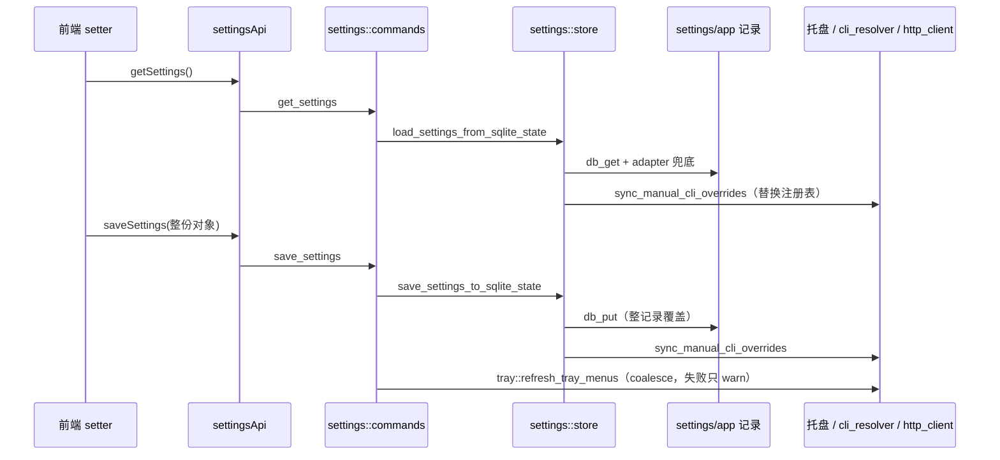

# Settings 后端模块说明

> 备份恢复（本地/WebDAV/仓库、加密、自动备份调度）见 `backup/AGENTS.md`，本文件不重复。数据库通用规则见根 `AGENTS.md` 的「SQLite JSONB Database Notes」。

## 一句话职责

- `settings/` 负责应用级设置（外观、启动、代理、备份开关、CLI 手动路径、UI 偏好）的读写：对外是 `AppSettings`，对内是 `settings` 表里 id=`app` 的单例 JSONB 记录。

## Source of Truth

- 权威数据是 SQLite `settings/app` 记录里的 JSONB；`AppSettings` 只是它的 Rust 投影，`adapter` 是唯一转换层（`from_db_value` 容错读取、`to_db_value` 全量序列化）。前端、托盘、各 coding 模块读到的都是这份记录。
- 记录不存在时读取返回 `AppSettings::default()`，**不会**回写；首次写入由各写入口按需创建。
- `settings` 表里还有别的 id：`backup_repository` 与 legacy `repository_sync`（备份域，见 backup 文档）。不要假设这张表只有一条记录。
- 派生/进程内状态，不是事实源：
  - `cli_resolver` 的手动 CLI 覆盖注册表——每次 `load/save` 用持久化值**整体替换**，空设置即清空；
  - 托盘菜单、窗口代理客户端、keep-awake、自动备份调度器都是读设置的消费者，不反向持有设置。
- provider 列表的排序偏好与最近使用时间不是独立表，存在同一条 app 记录的嵌套键 `provider_sort_modes` / `provider_last_used` 里（`provider_list_state.rs`）。

## 核心设计决策（Why）

- 用 adapter 而不是直接 serde：旧库、旧备份、旧版本记录必然缺字段或类型漂移，读取端要按字段兜底默认值且永不 panic；写入端始终产出完整结构。DB 键名即 Rust 字段名（snake_case），前端也按同一套名字读，**不做 camelCase 重命名**。
- 默认值分两处且刻意不同：`AppSettings::default()` 表示「从未保存过」，`adapter::from_db_value` 的缺省表示「记录存在但缺这个键」。例如 `language` 缺省是**空串**（前端据此显示「系统默认」并跟随系统语言），`current_module` 在 adapter 里是 `"coding"`、在 `Default` 里是空串。把两者「统一」会让「系统默认」选项消失或让旧记录突然被钉死在某个语言上。
- 只有整体保存，没有字段级 update 命令（少数专用命令除外）：设置是小对象，整份覆盖语义简单；代价是并发写必须由调用方串行化，且**同一记录里的所有键都必须属于 `AppSettings`**。
- 几个高频/后台写入者走 `db_patch_fields` 只动自己的嵌套键（`session_detail_filters`、`provider_sort_modes`、`provider_last_used`、`last_auto_backup_time`），避免「后台写时间戳时用旧快照覆盖用户正在改的表单」；备份表单保存同事务内也只 patch 自己拥有的字段。它们之所以与「全量保存」不互相覆盖，是因为各自改的是不相交的键。
- `visible_tabs` / `sidebar_hidden_by_page` 的历史默认兼容放在 adapter 读取端做「一次性识别 + 全量替换」，而不是 schema 迁移：判断依据是「当前列表逐项等于某个历史默认快照」。自定义顺序**原样保留**，也**不**给自定义列表强插新增 tab（否则用户手动关掉的 tab 会在每次重载时回来）。

## 关键流程

- 核心设置模块**不发**任何 Tauri 事件（备份域的 `auto-backup-completed` / `auto-backup-failed` 见 `backup/AGENTS.md`）：设置变化对托盘的可见性靠 `save_settings` 命令内的刷新调用，不是事件广播。其它消费者（代理客户端、runtime location）都在各自使用时重新读库，没有缓存失效协议。
- 恢复流程会整库覆盖 `settings/app`；「恢复开始前先读设置」的时序规则属于备份域，见 `backup/AGENTS.md`。

## 易错点与历史坑（Gotchas）

- **`save_settings` 是全量替换**：adapter 只序列化 `AppSettings` 的字段，任何「存在 app 记录里但不在 `AppSettings` 结构里」的键都会在下次前端保存时被静默删除。新增这类键必须同时加到 `types.rs` + `adapter.rs`，否则不要放进这条记录。
- **前端必须提交完整对象**：`AppSettings` 没有 `#[serde(default)]`，缺字段的 payload 会让 `save_settings` 直接反序列化失败（不是静默丢数据）。前端所有 setter 的约定是 `getSettings()` → spread 改一个字段 → `saveSettings()`。
- **读-改-写有并发窗口**：`set_manual_cli_path`、`save_provider_sort_mode`、`record_provider_last_used` 都是「先 load 再 save/patch」，且分两次取 DB 锁；两次之间插入的其它写入会被回退。新增此类命令时尽量把读写放进同一个 `with_conn` 闭包，或明确接受这个窗口。前端 `save_settings` 之间的并发由调用方串行化（如 `keepAwakeSettings` 的队列、language 保存前的 preference 重查）。
- **`sync_manual_cli_overrides` 是副作用，不是纯读取**：任何一次 load/save 都会用持久化值整体替换 `cli_resolver` 的进程内注册表——加载默认（空）设置会清空它。测试里依赖注册表的用例必须持 `coding::test_env::lock()`（`sync_manual_cli_overrides` 在 `cfg(test)` 下持同一把锁），详见 `coding/AGENTS.md`。
- **语言空串不是 bug**：备份表单会以 `{}` 创建 app 记录并只 patch 自己拥有的字段，所以「记录存在但没有 language」是真实形态；读成具体语言会让前端把它当成显式选择。
- **新增 tab 要同时改三处**：adapter 的 `CURRENT_DEFAULT_VISIBLE_TABS` + 一份「加入前的默认快照」常量、`default_sidebar_hidden_by_page()` 的 key 集合、前端 `settingsApi` 的 `SIDEBAR_PAGE_KEYS` / `defaultSettings`。`sidebar_hidden_by_page` 的读取**不按 allowlist 过滤**（曾因此把新页面丢掉、开关重启后复位），默认集合只是为了新库有完整键。
- **`get_session_detail_filters` 的 `None` 有语义**：表示「从未保存」，前端回落全可见；若 key 存在但嵌套布尔只写了一部分，adapter 按逐项默认（全可见）补齐，不会整块丢弃。
- **`set_auto_launch` 与 `launch_on_startup` 是两条路**：命令直接操作系统自启动项（不写库），库里的 `launch_on_startup` 只在启动时被读一次并调用 `enable_auto_launch()`（关闭时**不**主动 disable）。前端 `setLaunchOnStartup` 会同时写库、调 `setAutoLaunch`，并顺手把 `start_minimized` 一并归零——后端不做这层联动。
- **托盘读的就是这份设置**：`tray::refresh_tray_menus` 内部调 `get_settings` 取 `visible_tabs` 与 `language`，且带 coalesce（并发刷新会合并）。设置保存后如果托盘没更新，先看这里而不是找事件。
- 代理设置（`proxy_mode`/`proxy_url`）由 `http_client` 在**每次建 client 时**重新读，改完即生效；`cli_manual_paths` 靠注册表同步即时生效；而 `minimize_to_tray_on_close`/`lightweight_on_close` 是关窗事件里现读库，`keep_computer_awake`/`start_minimized`/`start_lightweight` 只在启动时读一次。

## 跨模块依赖

- 依赖 `db::helpers` + `SqliteDbState`；依赖 `tray`（保存后刷新）、`auto_launch`、`keep_awake`、`coding::cli_resolver`（注册表）、`http_client`（代理）。
- 被几乎所有后端模块依赖：`runtime_location`（`opencode_use_legacy_oh_my_config` 决定 OMO 写入目标）、`session_manager`、`proxy_gateway`、`update`、各 coding 模块的启动初始化等，都通过 `settings::store` 读。
- 对外契约：`AppSettings` 的字段名/类型就是 DB 键与前端接口（`web/services/settingsApi.ts` 手工镜像同一套类型）；`settings::store` 的 load/save 是唯一入口，不要绕过它直接写 `settings/app`（否则注册表不同步）。
- 备份域依赖本模块：`backup/` 的生成、自动备份、恢复前决策都调用 `load_settings_from_sqlite_state`。

## 典型变更场景（按需）

- **新增设置字段**：`types.rs`（字段 + `Default`）→ `adapter.rs`（读取 + 默认值，注意「记录缺键」与「从未保存」两种语义）→ 前端 `settingsApi.ts` 类型/`defaultSettings`、`settingsStore.ts` 初始化与 setter → 如影响托盘/i18n 再补对应联动。DB 不需要迁移。
- **新增 tab / 页面**：见上文三处；同时检查托盘可见性与备份的 always/optional 分类是否需要同步（`backup/AGENTS.md` 的接入清单）。
- **改保存语义**：至少检查托盘刷新、`cli_resolver` 注册表同步、备份生成与恢复前读设置的时序，以及前端是否有 setter 依赖「整份覆盖」的假设。

## 最小验证

- `cd tauri && cargo test --lib settings --jobs 2`：覆盖 adapter 默认值与历史默认迁移、`store` 的 SQLite 往返、嵌套 patch 不覆盖其它字段、记录缺失时按需创建、`provider_list_state` 的合并与刷新语义。
- 手工路径：改主题/语言/可见 tab → 重启后保持；清空语言回到「系统默认」并跟随系统；托盘菜单跟随 `visible_tabs`；改代理后新建请求走新代理。
- 涉及备份域的改动跑 `cargo test --lib settings::backup --jobs 2`（见 `backup/AGENTS.md`）。
- 本轮只改文档或静态逻辑时，明确说明未做真实「改设置 → 重启 → 托盘」端到端验证。

## 何时更新本文件

- 新增/改变设置字段语义、保存语义、或发现新的并发/副作用坑时，同一任务内写回。
- 若经验对所有模块都成立（如「读-改-写要在同一连接闭包内」），同步补根 `AGENTS.md`。
