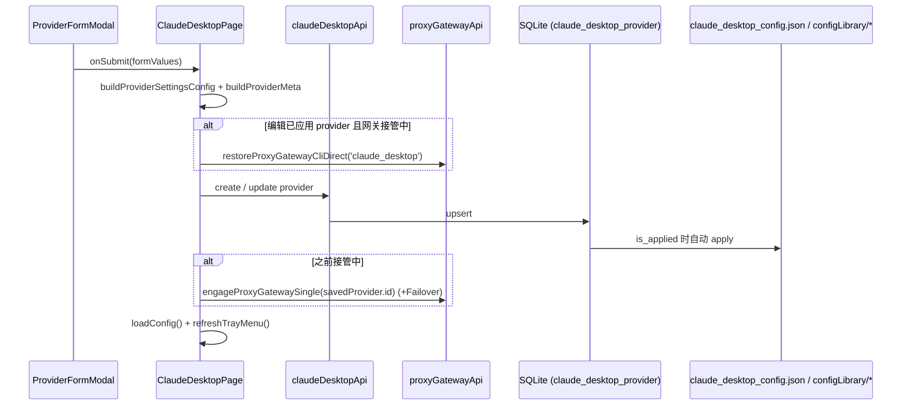

# Claude Desktop 前端模块说明

## 一句话职责

- `claudedesktop/` 页面负责 Claude Desktop 3P 供应商（SQLite 记录）的增删改查、应用到磁盘 profile、通用配置、全局提示词与会话浏览。

## 与 `claudecode/` 的边界（最重要）

本模块**大量复用** claudecode 的代码，但两者的数据模型不同。改动前必须先分清"共享的是样式还是语义"：

| 复用方式 | 具体对象 | 性质 |
|---|---|---|
| 直接 import 逻辑 | `claudecode/utils/claudeModelConfig.ts`（`parseClaudeSettingsConfig` / `getClaudeProviderModelConfig` / `getClaudeConfiguredModelIds` / `hasClaudeOneMMarker` / `setClaudeOneMMarker` / `stripClaudeOneMMarker`） | **共享语义**：`settingsConfig.env` 的 `ANTHROPIC_*` 键在两边同形，改这个文件会同时影响两页 |
| import 样式 | `claudecode/components/CommonConfigModal.module.less` | 只共享视觉 |
| 复用 i18n key | 51 个 `claudecode.*` key（`claudecode.model.*` / `claudecode.provider.*` / `claudecode.fetchModels.*` / `claudecode.apply.success` …） | **共享文案**：改这些 key 的措辞会同时改两个页面，且 `i18n:prune` 依赖两边都在用 |
| 独立实现 | 卡片 `ClaudeDesktopProviderCard`、表单 `ClaudeDesktopProviderFormModal`、`ClaudeDesktopCommonConfigModal` | 不复用 claudecode 的组件 |

**关键差异（不要按 claudecode 的直觉改这里）**：

- **模型路由的存储位置不同**。Claude Code 写 `settingsConfig.env.ANTHROPIC_DEFAULT_*_MODEL`；Claude Desktop 的**单一事实源是 `meta.claudeDesktopModelRoutes`**（route_id → `{ model, labelOverride, supports1m, tierAlias }`），`env` 只承载 `ANTHROPIC_BASE_URL` / `ANTHROPIC_AUTH_TOKEN` 两个凭据键。`buildProviderSettingsConfig` 只写这两个 env 键是**有意的**，不要"补齐"成 claudecode 那套 env 模型字段。
- **1M 的表达方式不同**。Claude Code 用模型串末尾的 `[1M]` 后缀持久化；Claude Desktop 用 `meta.claudeDesktopModelRoutes[route].supports1m` 布尔字段。表单里的 `[1m]` 标记只是**输入态**：`buildClaudeDesktopModelRoutes` 会 `stripClaudeOneMMarker` 后再存 `supports1m`，回填时再用 `setClaudeOneMMarker` 还原成勾选态。**把标记原样存进 `model` 会同时造成两个故障**：① Direct 模式把 `upstream != route_id` 判成模型映射而报错；② `is_claude_safe_model_id` 会拒收带 `[1m]` 的值。
- **route_id 是固定的 claude-safe 名**（`claude-sonnet-5` / `claude-opus-5` / `claude-fable-5` / `claude-haiku-4-5`，镜像 cc-switch 的 `CLAUDE_DESKTOP_ROLE_ROUTE_IDS`）。这个常量在**三个文件里各有一份**（page / card / form modal），是刻意的就近拷贝；改一处必须同时改三处，否则表单存进去的 route 卡片读不出来。
- **没有 `__local__` 桥接项**。Claude Desktop 的 provider 是 SQLite 记录，不是本地配置文件收编来的，所以卡片列表里不存在 claudecode 那种"未入库的当前生效配置"，批量选择的全集就是可见列表本身。
- 卡片是**独立实现**（不是共享 `ProviderCard`），因为它有角色模型网格、网关胶囊和 P0/P1 优先级徽标；本页也**未**接入共享 `ProviderListSection`。

## Source of Truth

- 供应商列表、`isApplied`、`isDisabled`、`sortIndex` 全部以后端 `listClaudeDesktopProviders()` 返回为准；页面只在**乐观拖拽**时短暂持有本地副本，失败即回滚。
- 磁盘上的 4 个受管文件（两个 `claude_desktop_config.json`、`configLibrary/<PROFILE_ID>.json`、`configLibrary/_meta.json`）是运行时事实，只在"应用"时被改写；**前端不解析它们做状态判断**，只通过 `getClaudeDesktopPreview()` 原样展示。
- 生效态由 `provider.isApplied`（DB）表达。**不要用 `deploymentMode` 判断**——那只是写盘标记，也不要用 `category === 'official'` 推断"当前是官方模式"。
- `meta.claudeDesktopModelRoutes` 是模型路由的事实源，但**卡片与连通性测试都必须容忍它不存在**：从 Claude Code 导入的行在重新保存前把角色模型放在 `env.ANTHROPIC_DEFAULT_*_MODEL` 里。卡片与表单各自实现了同一套 env → routes 回退派生，两处都要保留。
- 通用配置（base config，如 `mcpServers`）存在 provider 表的保留 id `__common__` 记录里，不在 provider 列表中出现。

## 核心设计决策（Why）

- **渠道（profile）在创建时固定，编辑时不可改**。`providerEndpointKey` 下拉在 `isEdit` 时 `disabled`；"官方渠道"选项只在**新建**或编辑一个已是 `category === 'official'` 的记录时出现。原因是后端 apply 判定官方回退靠"seed id 或 `category=official` 且 env 无凭据"，把一个带凭据的自定义渠道改成 official 会写出语义矛盾的行。
- 官方模式保存的是 `{"env":{}}`（`buildProviderSettingsConfig` 的第一分支），这是**触发后端 restore_official 的信号**，不是"空配置"。`buildProviderMeta` 在 official 分支会清掉 `claudeDesktopModelRoutes` / `apiFormat` / `gatewayProfile` / `customHeaders`(含 snake_case) / `customUserAgent`(含 snake_case) / `modelRewrites`(含 snake_case)——这些键对 1P 无意义，留着会在切回自定义时把旧配置复活。
- `meta.claudeDesktopMode` 是**废弃字段**，`buildProviderMeta` 无条件 `delete`。新代码不要读它、也不要写它。
- 保存一个**已应用**的 provider 时会走 `saveProviderWithGatewayReengage`：网关接管中先 `restoreProxyGatewayCliDirect('claude_desktop')`，保存，再按原模式重新接管（single → `engageSingle(savedProvider.id)`，failover → 再叠 `engageFailover`）。**顺序不能改**——后端 `update_claude_desktop_provider` 在 `is_applied` 时会自动重新 apply，而 apply 又被 `ensure_claude_desktop_gateway_direct` 拒绝（"已由网关接管"）。所以必须在保存前脱离接管。**本页没有 `engageAggregate`**：聚合是 Codex 专属，`resolveGatewayReengageMode` 对 Claude Desktop 永远不会返回 `aggregate`；不要照抄 codex 页补上这个回调。
- `saveProviderWithGatewayReengage` 的 `engageSingle` 闭包读的是 `savedProvider`（在外层声明、由 `saveProvider` 赋值），不是 `editingProvider`。**新建（`isCopyMode` 或 `!editingProvider`）时 `shouldReengageGatewayProxy` 必为 false**（它要求 `editingProvider.isApplied`），所以这条闭包在新建路径上不会被调用；但仍不能把它改成读 `editingProvider`。
- 通用配置保存后，后端会自动重新 apply 当前已应用的 provider（同样被网关接管守卫拦截，失败只打日志）。前端只负责保存与提示，不要自己再调一次 apply。

## 关键流程

## 易错点与历史坑（Gotchas）

- **`buildProviderMeta` 必须基于 `existingMeta` 展开再删键**，不能从 `{}` 重建：`meta` 里还有后端/其它入口写入的键（如 `providerType`），重建会静默丢失。official 分支删的是"该模式不该有的键"，不是"整个 meta 重来"。
- **1M 输入框必须通过 `getValueProps` 只显示剥离后的 base**，`getValueFromEvent` 再按当前状态重组。把存储值直接渲染进输入框，用户在末尾退格或补字会与重组逻辑相互作用，堆积出 `xxx[1M][1M]`。同一模式已在 claudecode 的兜底模型行上修过，两处必须一致。
- `handleRoleOneMChange` 的 display-name 同步是**有条件**的：只有显示名为空、或等于旧 base 时才跟着改。用户手填过显示名后，改 1M 不该覆盖它。同理 `getValueFromEvent` 里的同步用 `setTimeout(..., 0)` 延后，避免与当前输入打架。
- **「一键设置」会覆盖所有角色**，源模型按 `model → sonnet → opus → fable → haiku` 取第一个非空。它是有意的整体操作，不要为了"保留某个角色"改成部分覆盖。
- `handleProviderEndpointChange` 选中内置 endpoint 时，Fable 用 `endpoint.models?.fable ?? ''`（**不回退** `endpoint.model`），其余角色都回退。这是刻意的：Fable 没有通用兜底模型可用，不要"顺手对齐"成和其它角色一样。
- 官方模式下 Base URL / API Key / 模型映射 / 高级区块**整体不渲染**（不是 `disabled`），只有 `name` 输入框渲染但 `disabled`。antd 的 `preserve` 默认为真，被卸载的字段值仍留在 form store 里，所以 `handleProviderEndpointChange` 切到 official 时必须**显式**把 `baseUrl` / `apiKey` / 五个模型字段 / 四个 tierAlias 置 `undefined`；`handleSubmit` 也额外在 official 时强制把 `apiFormat` / `customHeaders` / `modelRewrites` 置为关闭态。两道保险都不能删——只靠"字段没渲染"会写出上一次自定义模式的残留值。
- 卡片上 `canRestoreDirect` 只看 `gatewayStatus.can_restore_direct`，**刻意不叠加 `needsGatewayProxy` gate**：Claude Desktop 的"恢复直连"语义是 restore_official（回到官方 1P），与当前 provider 能否直连无关。曾经的死锁正是"apply 被接管锁住 + restore-direct 被 needsProxy 禁用"两边都不可用（issue #313）。其它 CLI 的 ProviderCard 保留那个 gate 是正确的，**不要跨模块对齐**。
- 卡片上 `canShowGatewayProxyButton` 要求 `showRuntimeApplied && !gatewayMode`；接管中所有其它卡片的"应用"入口变成 `showGatewayLockedApply`（disabled）。这是有意的锁定，不是渲染 bug。
- 官方 provider 在网关接管中会显示金色"已被网关接管"标签（`gateway.takeover.officialBypassedTag`），因为接管期间 1P 官方配置被旁路。`gatewayTakeoverActive` 取 `can_restore_direct`，与卡片里的 `gatewayMode` 是两个独立判据。
- **批量删除与单删都要先写收藏**（`upsertFavoriteProvider` + `buildDesktopFavoriteProviderConfig`），批量走 `backupProvidersBeforeDelete`（任一备份失败即中止整批）。本页的 provider id 就是 DB 主键，收藏 payload 是完整可重放的 `ClaudeDesktopProviderInput` 形状。
- 从 Claude Code 导入（`handleImportFromClaude`）是**后端批量创建**，只返回数量。所以前端必须重新拉列表、用导入前的 id 集合做差集，再补写收藏——不要假设命令会返回新建的行。
- CC Switch / All API Hub 导入用 `sourceProviderId` 去重（不是 provider id），"已存在"的判定与弹窗的 `existingProviderIds` 必须传同一份 `sourceProviderId` 集合。
- 会话详情走隐藏二级路由 `/coding/claudedesktop/sessions/detail`，由 `routeConfig.chrome` 声明 `mode: 'secondary'` + `ownerTabKey: 'claudedesktop'`。**侧栏分区跳转靠 `expandNonce`**：`onSectionSelect` 对 prompt / session 两个分区各自递增 nonce，并给 `GlobalPromptSettings` 加 `key={...-${promptExpandNonce}}` 强制重挂载来展开折叠面板。删掉这个 key 或 nonce，侧栏点击就会"没反应"。
- 页面头部**文案仍是硬编码中文**（标题、分区名、"通用配置"、"新增供应商"、导入按钮、通用配置 Modal 的标题与提示），尚未迁移到 `CodingPageHeader`。新增文案时不要引入第三套写法（既不硬编码、也不新造 key 前缀）；迁移是已登记的工作项，见 `docs/new-cli-onboarding-sop.md` §4.3。

## 跨模块依赖

- 后端 `claude_desktop::*` 命令（`web/services/claudeDesktopApi.ts`）。**3P profile 的写盘顺序、`_meta.json` / `configLibrary` 语义、`is_claude_safe_model_id` 规则、网关接管对文件的改写都不在本文件重复**，见 `tauri/src/coding/claude_desktop/AGENTS.md`。
- `shared/gateway`：`GatewayFailoverButton`（供应商列表标题行的接管胶囊，claude_desktop 是受支持 cli key 之一）、`saveProviderWithGatewayReengage`、`providerProfiles`（内置渠道 catalog）。
- `shared/providerList`（搜索/排序/批量/收藏备份，排序模式用带 `createdAt` 的 `PROVIDER_SORT_MODES`）、`shared/providerShare`、`shared/prompt`（`claudeDesktopPromptApi`，提示词文件是 Claude Desktop 正常配置目录下的 `AGENTS.md`）、`shared/sessionManager`（`tool="claudedesktop"`）。
- `shared/providerHeaders` / `shared/providerModelRewrites`：`customHeaders` / `modelRewrites` 经 `mergeCustomHeadersIntoMeta` / `mergeModelRewritesIntoMeta` 写进 meta，由网关在转发时消费。
- 与 claudecode 共享 `claudeModelConfig.ts` 与 51 个 `claudecode.*` i18n key（见上文边界表）。
- 事件：`config-changed`、`TRAY_CONFIG_REFRESH_EVENT`（托盘回灌 `loadConfig(true)`）、`gateway-running-changed`（由 `GatewayFailoverButton` 内部监听）。

## 典型变更场景（按需）

- 改角色集合或 route_id：三个文件的 `CLAUDE_DESKTOP_ROLE_ROUTE_IDS` / `_ORDER` 必须同步；再检查 `buildClaudeDesktopModelRoutes`、卡片网格、表单回填、`inferenceModels` 消费方（后端）。
- 改 `buildProviderMeta`：同时检查 official 分支的删除名单、`customHeaders`/`modelRewrites` 的合并顺序、以及"编辑后保存不丢未知 meta 键"。
- 改网关交互：确认 `saveProviderWithGatewayReengage` 的 restore → save → re-engage 顺序未被破坏，且没有给 Claude Desktop 引入 `engageAggregate`。

## 最小验证

- 新建一个自定义渠道并应用：卡片出现「已应用」；磁盘两个 `claude_desktop_config.json` 的 `deploymentMode` 变 `3p`，`configLibrary/<PROFILE_ID>.json` 与 `_meta.json` 更新（用「预览配置」核对）。
- 应用一个官方渠道：`deploymentMode` 回 `1p`，profile 被删，`_meta.json` 的 `appliedId` 清空。
- 角色模型填 `deepseek-chat` 并勾 1M：保存后 `meta.claudeDesktopModelRoutes` 里 `model` 是 `deepseek-chat`（无 `[1m]`）且 `supports1m: true`；重新打开表单时输入框显示 `deepseek-chat`、复选框勾选；再次保存不产生 `[1m][1m]`。
- 网关 single 接管中编辑并保存**已应用**的 provider：保存前后网关仍是接管态，且 profile 里的模型映射仍是新值（不是被 restore 丢掉的旧值）。
- 网关接管中：其它卡片的「应用」按钮为禁用态，官方卡片显示金色旁路标签；「恢复直连」可用且不受当前 provider 协议限制。
- 批量删除两个渠道：收藏历史里两条都在；任一收藏写入失败时整批不删除。
- 从 Claude Code 导入：新行的角色模型来自 `env.ANTHROPIC_DEFAULT_*_MODEL`，卡片能正确显示映射（无需重新保存）。
