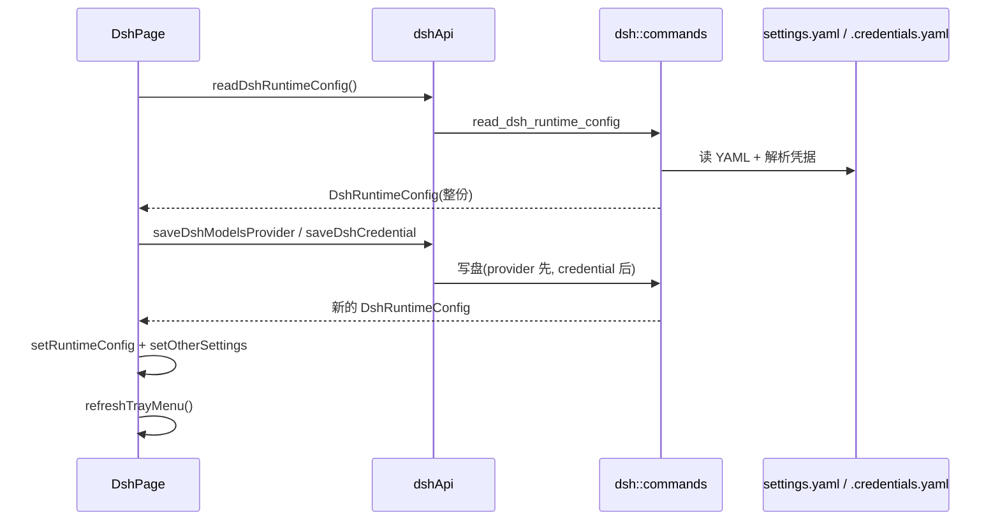

# DSH 前端模块说明

## 一句话职责

- `dsh/` 页面负责 DeepSeek Harness 的**可视化编辑面**：默认模型、供应商（route）、凭据、全局提示词、其他配置与会话浏览。

## Source of Truth

- 唯一读入口是 `readDshRuntimeConfig()`（后端 `read_dsh_runtime_config`），页面不推导、不缓存、不合成派生状态。
- 所有写命令（保存默认模型 / 供应商 / 凭据 / 其他配置）**都返回整份新的 `DshRuntimeConfig`**。页面必须用返回值整体替换 state（`setRuntimeConfig(nextConfig)` 后再 `setOtherSettings(nextConfig.otherSettings || {})`），不要只做局部 patch——后端才是文件内容的事实源，本地 patch 会与磁盘漂移。
- `runtimeConfig.providers` 里**包含没有配置文件条目的 route**：后端把 `agent-default-model.provider` 也并进 key 集合。此时 `provider.provider === undefined`（无条目），与"有条目但内容为空对象"是两种语义，删除与保存分支都依赖这个区别。
- 模型记录一律经 `getDshModelRecords()` 三层回退取得：显式 `models` → 适配器内置目录（`modelSource === 'builtin'` 时的 `builtinModels`）→ 空。不要在组件里另写一套回退，否则卡片显示、拉取模型、连通性测试三处会看到不同的模型集合。
- `provider.apiKey` 是后端从 `.credentials.yaml` 解析出的**真实密钥**（`records["llm-pi-ai/<route>"]` 优先，回退 `apiKeyEnv` 指向的 ref）。前端只用于只读回填与收藏备份。卡片上的 `MASKED_CREDENTIAL` 是"已配置但后端未回传值"的占位符，**不是值**，任何写回路径都不得使用它。
- `credentialsContent`（配置预览弹窗）含真实密钥，只读展示。

## 核心设计决策（Why）

- 本页是**配置文件型** tab：没有 `createdAt`，排序模式用 `PROVIDER_SORT_MODES_BASIC`，最近使用只在"设为默认模型"成功后由页面 `noteProviderUsed` 记录（窗口路径），托盘路径由后端内部记录。**漏掉这个调用会让"最近使用"排序在本页永远不更新**——DB 型 tab 靠后端 apply 汇聚函数兜底，本页没有那个兜底点。
- 删除支持三种 scope：`credential` / `provider` / `both`。`handleDeleteSupplier` 先分流：只有**同时**有凭据和 provider 配置才弹 scope 选择框，否则直接按唯一存在的部分删除。
- 批量删除必须走 `buildDshProviderDeletionPlan`：一个 `apiKeyEnv` 可被多个渠道共享，plan 负责算出"删到哪个渠道才轮到删 ref"，并在**删除前**一次性快照全部凭据交给 `backupProvidersBeforeDelete`。禁止在循环里一边删除一边读下一条的凭据状态——前一次删除会改变后一次的 `credentialExists`。回归见 `web/test/features/coding/dsh/utils/providerDeletion.test.ts`。
- 导入顺序固定为**先 provider 再 credential**。反过来（先写 Key）在 provider 落盘失败时会留下无人引用的孤立 credential，而 UI 上所有删除入口都挂在 provider 卡片上，用户无法清理它。
- `buildDshCredentialRef` 的 base 取 `providerId`（ASCII slug）而非 `name`：CJK 显示名会被折叠成同一条下划线串，导致多个中文渠道共用同一个 ref 互相覆盖。回归见 `web/test/features/coding/dsh/utils/importMapping.test.ts`。
- 内置渠道在编辑时**隐藏且不写** `displayName` / `api`：这两个值由适配器 catalog 决定，保存路径会主动 `delete` 它们。不要"顺手补上"，写进去会与 catalog 打架。
- `authHeader` 是历史遗留键（dsh 没有这个概念），保存供应商时无条件删除。

## 关键流程

## 易错点与历史坑（Gotchas）

- **默认模型保存带请求代次守卫**（`modelSettingsSaveSeqRef`）：连续切换 provider/model 时只有最后一次响应会写回 state 与提示。新增同类"表单即改即存"逻辑必须沿用这个模式，否则慢响应会把新值覆盖回旧值。
- `handleModelSettingsChange` 有两个短路，改这段时必须保留：① 切换 `defaultProvider` 时，只有新 provider **声明了** `modelIds`（非空）且当前默认模型不在其中才清空 `defaultModel`——空列表表示"未声明"，不能当成"没有这个模型"；② 三个字段与 `runtimeConfig.modelSettings` 完全相同时直接 `return`，避免表单挂载/回填时触发一次无意义的写盘与托盘刷新。
- `reasoningEffortOptions` 取自所选模型的 `reasoningEfforts` 键集合，模型未声明时回退 `low/medium/high`。不要写死成固定列表，否则模型新增的等级（如 `max`）无法选择。
- `reasoningEfforts` 的 `null` 清洗出现在两处（拉取模型 `buildFetchedDshModel` 与保存模型 `handleSaveDshModel`）：共享的 `buildPiThinkingLevelMapFromPreset` 会给预设不支持的等级填 `null`，直接落盘会让 dsh 以为该等级可用。两处都必须过滤 `null` / `undefined` / `''`。
- `DSH_KNOWN_MODEL_FIELDS` 是模型字段白名单：保存时先删除所有不在表内的键，再合并 `extraParams` 编辑器的内容。**新增模型字段必须同步加进这个集合**，否则用户填的值会被"额外参数"编辑器当成未知键洗掉；反过来，从集合里删键前要确认它不是后端 schema 的字段。
- 模型弹窗刻意 `showReasoning={false}`（表单不提供开关）但仍通过 `initialValues` 传入 `reasoning`，`handleSaveDshModel` 会保留它。不要因为"表单里看不见"就把它从白名单里移除，那会在保存时静默清空已存的 `reasoning: true`。同理 `showCost={false}`，cost 由 handler 自己从 `nextModel.cost` 重建。
- 删除模型（单个 / 批量 / 连通性测试移除）后，如果被删的正是默认模型，必须再调一次 `saveDshModelSettings` 把 `model` 清空并同步 `modelForm`。三处删除路径都要做，漏一处会留下指向不存在模型的默认值。
- 其他配置（Other Settings）是失焦自动保存：保存前必须过 `otherSettingsValid`，非对象（数组/标量）一律按 `{}` 处理。托管键（`llm-pi-ai`、`agent-default-model`）由后端保留不回写文件，**前端不需要也不应该自己剔除**。
- `agentInstructionsEnabled` 的作用域必须如实呈现：启用只写 home 级 `cordis.patch.yml`，只对 dsh tui / headless 等 base profile 生效；Web 会话的 agent-instructions 由 per-session agent preset 决定，本开关既不反映也不控制它。同一句 `dsh.agentInstructions.scopeNote` 在**两个位置**渲染（未启用时的 Alert description、已启用时的提示行），"一个事实一个 key"是有意的，不要拆成两句或只改一处。
- 「打开 Web UI」是两阶段回退：`openDshWebUi()` 抛错才弹 Modal；Modal 的 `'initial'` 阶段启动 `dsh web`，启动失败再切到 `'npx'` 阶段（okText 同时换成"使用 npx 启动"）。npx 阶段再失败就只报错并关闭。不要把它简化成一次调用。
- 几乎所有写操作成功后都要 `refreshTrayMenu()`：托盘 provider 菜单是另一条独立消费路径，不刷新会显示陈旧状态。
- 「设为默认模型」除了 `saveDshModelSettings` 还要同步 `modelForm` 的三个字段，否则表单显示与 `runtimeConfig` 不一致，下一次 `onValuesChange` 会拿旧值去比较并触发一次多余保存。

## 跨模块依赖

- 后端 `dsh::*` 命令（`web/services/dshApi.ts` 一一对应）。**settings.yaml / .credentials.yaml 的 YAML 语义、凭据版本化布局、会话产物命名规则、cordis patch 适配都不在本文件重复**，见 `tauri/src/coding/dsh/AGENTS.md`。
- 共享层：`shared/providerList`（搜索/排序/批量/收藏备份）、`shared/providerShare`、`shared/prompt`（`dshPromptApi`）、`shared/sessionManager`（`tool="dsh"`）、`shared/useRootDirectoryConfig` + `shared/RootDirectoryModal`。
- 事件：`config-changed`、`TRAY_CONFIG_REFRESH_EVENT`（托盘刷新回灌 `loadConfig(true)`）。
- 收藏 provider 走 `favoriteProviders` 的 `dsh` source 前缀；payload 形如 `{ providerKey, credential?, modelsProvider }`，凭据与 route 一起存，重导入时两份都要重放。

## 典型变更场景（按需）

- 新增供应商字段：同时检查表单回填、`handleSaveProviderModal` 的 `setOptionalStringField`/删除分支、内置渠道的"不写"名单、分享快照（`onShare` 的 `settingsConfig`）、收藏 payload 五处。
- 改凭据相关逻辑：同时检查 `credentialRefFromProviderKey`、`buildDshCredentialRef`、批量删除 plan、收藏备份、导入顺序（provider 先）四处一致性。
- 改模型字段：先确认是否要进 `DSH_KNOWN_MODEL_FIELDS`，再检查 `ModelFormModal` 的 `show*` 开关与 `extractDshExtraParams` 的边界。

## 最小验证

- 打开本页：能读到当前配置目录与供应商列表；配置目录为空时显示空态而不是报错。
- 保存一个自定义供应商（含 API Key）后：`settings.yaml` 的 `llm-pi-ai.providers.<route>` 与 `.credentials.yaml` 同时更新，其余 section 与未知键逐字未变。
- 编辑一个**内置**渠道后：`displayName` / `api` 未被写入该 route。
- 两个渠道共享同一 `apiKeyEnv` 时批量删除其一：ref 保留、凭据不丢；两个都删时只删一次 ref，且两份收藏都保留原密钥。
- 删除默认供应商的当前默认模型：默认模型被清空，表单与托盘同步。
- 连续快速切换默认模型：只有最后一次结果生效，中途响应不回滚 state。
