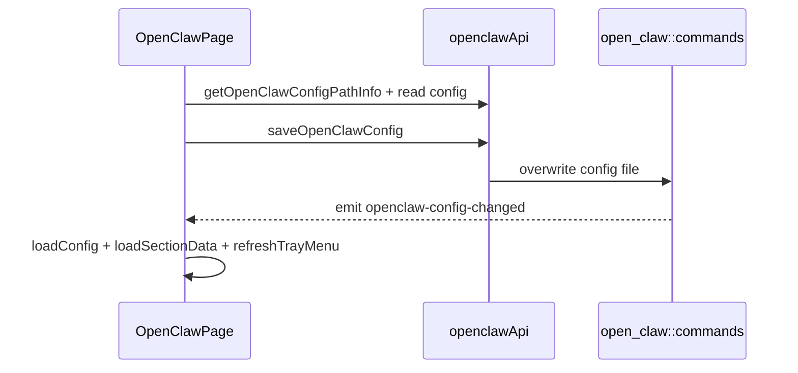

# OpenClaw 前端模块说明

## 一句话职责

- `openclaw/` 页面负责 OpenClaw 整份配置的读取、编辑、导入、provider 管理和配置路径管理。

## Source of Truth

- 页面状态最终都汇聚到同一份 OpenClaw 配置文件；各 section 只是对该配置对象不同片段的编辑界面。
- `configPathInfo` 来自后端 `getOpenClawConfigPathInfo()`，只表达路径来源，不表达 WSL Direct 状态。
- 页面刷新依赖 `openclaw-config-changed` 专有事件和显式 `loadConfig()/loadSectionData()`。

## 核心设计决策（Why）

- OpenClaw 页面采用“整份配置对象 + 多个 section”的模式，而不是 provider/common config 分表模式；这样与 OpenClaw 运行时 JSON 更一致。
- `OpenClawConfigPathModal` 只在 `source === custom` 时回填当前值，避免把 env/default 等来源误写成用户输入。
- 保存、导入、删除 provider 后都会显式 reload 和 tray refresh，因为页面 section 状态分散，不能只局部 patch 一个局部状态就结束。
- **复制供应商 / 复制模型走「新增 + 预填」**（2026-10-07 补：此前两个复制按钮都没有，是全仓唯一缺失的页面）。`handleCopyProvider` / `handleCopyModel` 与编辑共用同一个弹窗，靠 `isCopy` 区分：弹窗预填来源值并把 id 加 `_copy` 后缀且**保持可编辑**，保存时落成一条新记录。⚠️ 复制模式下 `handleModelSubmit` **不能**按 `editingModel.id` 去找下标替换——那会把源模型覆盖掉，必须走 `push` 分支（`isCopy` 的判定要贯穿提交路径，不只是在弹窗里）。
- **本页的供应商卡片与模型行能力集**（对照 SOP §4.2.2 / §4.2.3 的清单）：供应商卡片 = 编辑 / 复制 / 分享 / 删除（默认模型不可删）/ 拖拽 / 批量选择；模型行 = 新增 / 编辑 / 复制 / 删除 / 拖拽 / 批量删除 / 连通性测试 / 获取模型。**没有**「设为默认模型」（默认模型在 `agents.defaults.model.primary`，由 `AgentsDefaultsCard` 管，不在模型行上）和「模型启用开关」（`models` 条目没有 `enabled` 键）。

## 关键流程

## 易错点与历史坑（Gotchas）

- 不要把 OpenClaw 的某个 section 当成独立配置源。它们最终都在改同一份配置文件。
- 页面监听的是 `openclaw-config-changed`，不是通用 `config-changed`。抽象公共逻辑时别把它漏掉。
- 「其他配置」失焦保存（`handleOtherConfigBlur`）必须先重读文件（`readOpenClawConfigWithResult()` + 共享的 `pickConfigSaveBase()`，见 `web/features/coding/shared/AGENTS.md`），再把**编辑器文本合并到最新文件上**（`mergeOpenClawOtherConfigFields`，`utils/openClawOtherConfig.ts`）；后端 `apply_root_section_diff` 会**删除 payload 里缺失的顶层 section**，所以用页面内存副本当基底、或只拼 `models`/`agents` 当 payload，都会把 MCP 页刚写进 `mcp.servers`（同一个 `openclaw.json`）的 server 整段删掉（issue #406 同形）。回归见 `web/test/features/coding/openclaw/utils/openClawOtherConfig.test.ts`。
- 本页面必须同时监听 `openclaw-config-changed` 和 `mcp-changed`：`mcp.servers` 与其余配置在同一个文件，但 MCP 页只发 `mcp-changed`。少了这个监听，页面的 `config` 与「其他配置」编辑器的文本都会停在旧值，下一次保存就把 MCP 写回旧列表。
- 「其他配置」编辑器**不展示 `mcp`**（`OPENCLAW_OTHER_CONFIG_HIDDEN_KEYS = ['models', 'agents', 'mcp']`）：编辑器文本就是要写回的部分，展示 `mcp` 副本意味着在盒子打开期间 MCP 页/托盘写入的 server 会被旧文本回退（重读基底也救不了，因为用户文本最后合并）。手动在文本里敲进去的 `mcp` 仍以用户输入为准，因为编辑器值最后合并。这与 OpenCode 的处理一致（`web/features/coding/opencode/utils/openCodeOtherConfig.ts` 的 `managedConfigFields`）。
- 其余 14 个 `saveOpenClawConfig` 调用点（导入、provider/模型增删、拖拽排序、批量删除）仍以页面 `config` 为基底整份落盘；它们靠上面两个监听事件保持新鲜。若新增“页面之外也能改 `openclaw.json`”的入口（另一窗口、外部编辑器、恢复流程），必须同时给它一个刷新本页面的信号，或在该调用点改成先重读。
- 导入 OpenCode / All API Hub / favorite providers 时，不仅要更新配置，还要同步处理 favorite provider 相关辅助状态。
- Fetch Models 用 `findPresetModelById` 补全能力时必须保留上游返回的 model id 原文（含大小写）。preset 匹配是大小写不敏感的，只能拿 context/cost/reasoning/input 等元数据，不能把 `minimax-m3` 改写成 preset 的 `MiniMax-M3`。

## 跨模块依赖

- 依赖后端 `open_claw::commands` 提供路径信息和整份配置读写。
- 依赖共享 favorite provider 和导入组件。
- 与设置页共享路径来源和 WSL Direct 大语义，但本页面本身只关心 `configPathInfo` 与专有配置变更事件。

## 典型变更场景（按需）

- 改配置路径弹窗时：
  同时检查回填、reset 和保存后 reload。
- 改任一 section 保存时：
  同时检查是否保住整份配置对象中的其它 section。

## 最小验证

- 至少验证：修改任一 section 后配置文件仍保有其它 section 内容。
- 至少验证：路径变更或配置保存后页面能通过 `openclaw-config-changed` / reload 看到最新状态。
- Fetch Models 命中大小写不同的 preset 时（例如上游 `minimax-m3` / preset `MiniMax-M3`），保存的 model id 必须仍是上游原文；可运行 `pnpm test:web -- web/test/features/coding/openclaw/utils/openClawFetchedModels.test.ts`。
- 复制：供应商卡片的复制按钮 → 弹窗预填 `_copy` id 且**可编辑**；保存后 `models.providers` 多一条新 key，**源 provider 原样保留**。模型行的复制同理：保存后 `models` 数组多一条，**源模型不被覆盖**（这两条正是 `isCopy` 判定漏在提交路径上时会失败的地方）。
