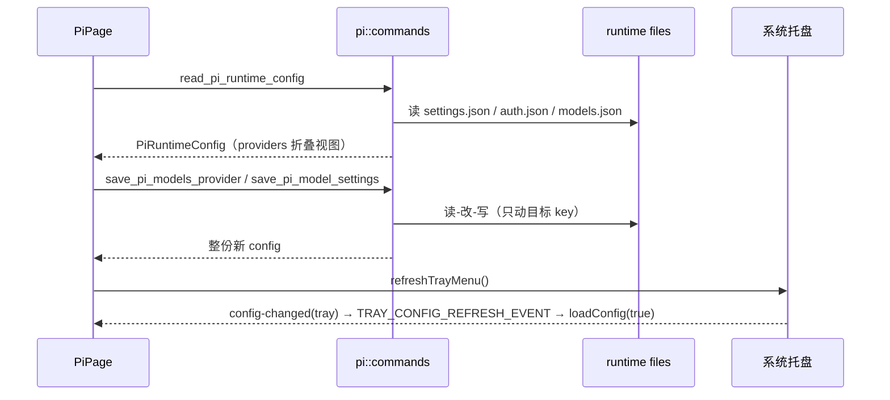

# Pi 前端模块说明

## 一句话职责

- `pi/` 页面负责 Pi CLI 运行时的可视化编辑面：模型默认项、供应商与模型目录、扩展、全局提示词、其他配置、会话。

## 与后端的边界

- 全部读写都落在 Pi runtime 文件上，由 `tauri/src/coding/pi/` 承担；文件语义、扩展 CLI 解析、config value 语法（`$ENV_VAR` / `!cmd`）、thinking ladder、删除 scope 与内置 provider 判定的权威说明在 `tauri/src/coding/pi/AGENTS.md`，这里不重复。

## Source of Truth

- 页面唯一状态源是 `readPiRuntimeConfig()` 返回的 `PiRuntimeConfig`。每个写命令（`savePiModelSettings` / `savePiAuthProvider` / `savePiModelsProvider` / `savePiOtherSettings` / `deletePiRuntimeProvider`）都返回**整份新 config**，页面直接 `setRuntimeConfig(nextConfig)`。不要在前端做乐观更新再等后端确认：托盘、MCP 页、深链导入、备份恢复都会绕过本页直接写文件，前端内存副本一旦被当成保存基底，就会把外部改动整段回退。
- `providers` 是后端把 `auth.json` + `models.json` + `settings.json` 折叠出的**只读视图**：同一个 key 可能同时来自 auth 与 models，写入必须分别走 `savePiAuthProvider` 与 `savePiModelsProvider`，删除必须显式选 scope。视图的 `isBuiltin` / `isDefault` / `sources` 只用于展示与按钮门控，不要在前端重算。
- `settingsContent` / `authContent` / `modelsContent` / `promptContent` 只服务预览弹窗，**不是**保存基底。
- favorite provider（storage key 前缀 `pi:`）是「用过的供应商 + 诊断缓存」，不是当前配置快照；每次写成功后 best-effort upsert，失败只 `console.error`，不能反过来影响主流程成败。

## 核心设计决策（Why）

- 模型设置卡是**变更即保存**（`onValuesChange` → `savePiModelSettings`），没有保存按钮。切 provider 时，若新 provider 有模型目录且旧 `defaultModel` 不在其中，会先清空它；思考级别只在旧值对新模型不成立时清空。这是有意为之——页面上不该出现「已保存但当前模型不支持」的组合。
- 自动保存用 `modelSettingsSaveSeqRef` 做代次守卫：只有最后一次请求的响应可以 `setRuntimeConfig` / 弹错误 / 收尾 `saving`，避免快速连点后旧响应覆盖新状态。
- 值没变时直接 return（对比 `runtimeConfig.modelSettings`），不写文件、不刷托盘。
- 供应商弹窗的四个「高级 JSON」（credential / headers / compat / modelOverrides）各自持有独立 state，保存时统一按「空则删键、非空则整块覆盖」回写。这是保留 `models.json` 未知字段的方式，但**空编辑器 = 删除该键**，不是「不动」；凭据编辑器为空时干脆不调用 `savePiAuthProvider`。
- 「获取模型」与「连通性测试」必须带 `configValueMode: 'pi'`，让后端按 Pi 的配置值语法解析 `apiKey` / header 再发请求。前端不解析模板，也不能把模板值拼进预览 URL。
- Fetch Models 命中 preset 时只借用能力元数据：写回 `models.json` 的 model id 必须是上游返回的原文（含大小写）。

## 关键流程

- 托盘事件由 `web/app/providers.tsx` 全局转发；本页监听 `TRAY_CONFIG_REFRESH_EVENT` 并 `preventDefault()`，用自己的 `loadConfig(true)` 静默重读替代整窗 reload。**不监听 payload 为 `window` 的 `config-changed`**，页面自身的写入只依赖命令返回值。

## 易错点与历史坑（Gotchas）

- **「保存供应商」的守卫**：`shouldSaveCredential` 只看凭据编辑器是否非空；`shouldSaveProviderConfig` 在「新建」或「已有 provider 的 `sources` 含 `models_json`」时恒真，其余情况才看渠道配置有没有内容。两者都为假才报 `selectAtLeastOneSection`——也就是说该错误只会出现在「编辑一个仅有 auth 来源的 provider，却把渠道配置也清空」这条路径上。改动这段判定前先想清楚「编辑已有 provider 想删掉哪些键」。
- 编辑已有 provider 时 `providerKey` 输入框禁用（改 key 等于换 provider）；复制会生成 `<key>_copy`，并把凭据原样带过去。批量导入**跳过**已存在的 key，不覆盖。
- 删除供应商：默认 provider 的删除按钮渲染成禁用 + tooltip（`deleteDisabledReason`），不是隐藏。同一个 key 同时有 `auth_json` 与 `models_json` 来源时先弹 scope 弹窗（provider_config / credential / both），只有一个来源时直接确认。删除前先把当前配置备份成 favorite provider——这是唯一的「撤销」来源。
- 批量删除的 `allIds` 必须用 `canBatchDeleteProvider` 过滤（排除默认 provider、必须有 `auth_json` 或 `models_json` 来源）；共享的 `backupProvidersBeforeDelete` 一旦有一条备份失败就中止整批，不要改成 best-effort。
- 删除模型（单删、批量删、连通性测试里移除失效模型）后，如果删掉的正是当前默认模型，必须再调一次 `savePiModelSettings` 把 `defaultModel` 置空：Pi 后端把空串当「删除该键」。漏掉这步会留下指向不存在模型的默认项。
- 默认模型下拉的候选是「当前 provider 的 `modelIds` ∪ 当前已保存的 modelId」，这样孤儿默认值仍能显示而不是静默清空；provider 下拉同理并入 `builtinProviders` 与当前值。
- 模型批量删除模式与拖拽互斥（`modelsDraggable={!isBatchDeleteMode}`）；搜索/非 `custom` 排序下也必须禁用拖拽，否则写回的 `models` 顺序与 `sort_index` 错位（共享规则）。
- `models.json` 的 model 记录允许字符串简写（`models: ["id"]`），读取时统一归一化成对象；保存时按对象写回。这是有意的规范化，不要为了「保持原样」再引入一条字符串写回分支。
- favorite provider 的去重身份由 `api` / `baseUrl` / `apiKey` / `headers` 组成：同身份多条时优先保留「当前 storage key」，其次模型更多、其次 `updatedAt` 更新。旧的收藏可能没有 payload，`resolvePiFavoriteProviderPayload` 会从 OpenCode 形状重建——改收藏结构时两侧要一起改。
- `maskCredential` 对 `$` / `!` 开头的值原样展示（那是配置值模板，不是密钥）；改动这里会影响所有卡片预览。
- 扩展区：本地 `.ts` 扩展只扫当前 runtime root 派生的 `extensions/`，不要硬编码默认 home；`pi-deck-*` / `ai-toolbox-*` 按内置处理，不给删除入口；更新按钮来自 list 结果的 `latestVersion`，查询失败只是没有版本，不代表列表失败。
- 扩展区的启用/禁用开关是**整包/整文件**语义（不是 `pi config` TUI 的逐资源勾选）：`enabled` 由后端从 `settings.json` 反解，前端不重算；写成功后只 patch 这一行的 `enabled`，**不要**整表 `loadExtensions()`——那会重跑 `pi list` 与 npm registry 查询。项目级行渲染成禁用开关 + tooltip（`enableDisabledReason`）并带"项目"标签（否则和用户级行长得一样，用户会以为项目内某个包已禁用/启用）。内置扩展（`pi-deck-*` / `ai-toolbox-*`）平时不渲染开关，**但 `enabled === false` 时渲染一个可用的"启用"开关**——否则被外部写死的禁用态在页面里没有恢复入口。
- 行的 React key 用 `${extension.id}#${index}`：`pi list` 对同一 source 会打多行（普通 + 带 filter），后端虽然已给重复 id 加 `#n`，但 key 里带上 index 才能保证列表顺序变化时不串行。
- `switchSupported === false` 的行不渲染开关（后端判定：本应用能写的 filter 改变不了 pi 的实际加载结果，如 manifest 驱动的目录扩展、`autoload: false` 的包条目）。不要在前端重算这个判定。
- `MagicContextSettings` 只在扩展列表里检测到 `@cortexkit/pi-magic-context` 时渲染；安装状态来自扩展列表，不要在 shared 组件里重复扫描。
- 「其他配置」编辑的是后端切出的 `settings.json` 切片（隐藏 `defaultProvider` / `defaultModel` / `defaultThinkingLevel` 与 `packages`），失焦保存；基底由后端重读文件，前端只负责文本与合法性。
- 本页**不参与 Gateway 接管**：Pi 不在 `GatewayCliKey::supported_mvp()` 里，只有用量统计包含它（`GATEWAY_USAGE_TOOLS`）。所以页面没有网关代理胶囊 / 恢复直连，也不要为了「跟其他 tab 一致」补上去；供应商表单里的计费 / 自定义请求头 / 模型改写这类「只由网关消费」的分区同理不应出现。
- 侧栏折叠状态读 `sidebarHiddenByPage.pi`、写 `setSidebarHidden('pi', …)`，两处都用 `pi`。
- 页头显示的是**配置目录**（`rootPathInfo.path`）而不是配置文件路径，这是 pi/ohMyPi 独有的真实差异；两页尚未迁移到共享 `CodingPageHeader`（见 `docs/new-cli-onboarding-sop.md` §4.3），迁移时应加 `configPathLabel` 之类的 prop，而不是把差异抹平。

## 跨模块依赖

- 后端 `pi::*` 命令（`web/services/piApi.ts` 一一对应）、prompt presets 走 `piPromptApi`。
- `shared/`：`useRootDirectoryConfig` + `RootDirectoryModal`、`GlobalPromptSettings`、`SessionManagerPanel`、`providerList`（搜索/排序/批量/最近使用）、`providerConnectivity`、`favoriteProviders`、`allApiHub`、`ccSwitch`、`providerShare`、`magicContext`。
- `constants/presetModels`（preset 元数据，需先 `fetchRemotePresetModels` 刷新缓存）与 `utils/piModelMetadata`（thinking 档位词表，必须与后端白名单同步）。

## 典型变更场景（按需）

- 新增 provider 字段：同时检查 `openProviderModal` 的回填、`handleSaveProviderModal` 的 `setOptionalStringField` / 显式 delete 分支、`buildPiFavoriteProviderConfig` 的归一化，以及 `fetchModelsProviderInfo` / `connectivityInfo` 的取值。
- 新增模型字段：检查 `ModelFormModal` 的 `show*` 开关与 `messageOverrides`、`handleSavePiModel` 的「有值才写、无值删键」映射、以及 `buildPiModelFromPreset` 是否也要补。
- 改思考档位：`utils/piModelMetadata.ts`、模型弹窗、后端校验白名单三处必须同步（`ultra` 属于 Codex，不属于 Pi）。
- 改「获取模型」应用逻辑：确认 preset 只补能力、id 保持上游原文。

## 最小验证

- 打开本页：模型设置卡显示当前 `settings.json` 的默认项；供应商列表含内置 provider 且不显示为 missing。
- 切换默认 provider：不属于新 provider 的默认模型被清空，`settings.json` 同步；再切回不会凭空恢复。
- 新建供应商只填 key + baseUrl：`auth.json` 与 `models.json` 各出现对应条目；只填其中一项时另一份文件逐字未变。
- 删除一个同时有 auth 与 models 来源的 key：出现三选一 scope 弹窗；选 `provider_config` 后 `auth.json` 条目仍在。
- 默认供应商的删除按钮为禁用 + tooltip；批量删除选择模式里它不可选。
- 删除当前默认模型后，`settings.json` 不再残留该 model id。
- 改扩展相关代码：自定义 root 下的扩展列表扫描 `<custom-root>/extensions`；`pi-deck-*` 无删除入口、无启用/禁用开关。
- 关闭一个扩展：行变灰并出现"已禁用"Tag，开关为关；`settings.json` 对应写入 `[]` 或顶层 `-extensions/xxx`。重新打开后开关回到开、Tag 消失，且**不需要**手动刷新列表。
- 改 Fetch Models 映射时跑 `node --test web/test/features/coding/pi/utils/piFetchedModels.test.ts`（大小写不同的 preset 命中后 id 仍为上游原文）。
- 任何写操作后托盘菜单同步（`refreshTrayMenu()` 不可省）；「更多选项」里的 CLI 路径覆盖 key 是 `pi`（`CliManualPathSetting commandName="pi"`）。
